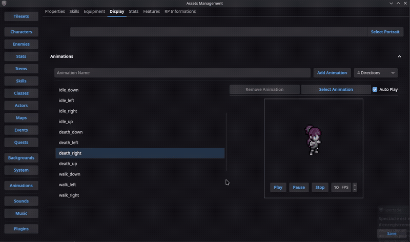
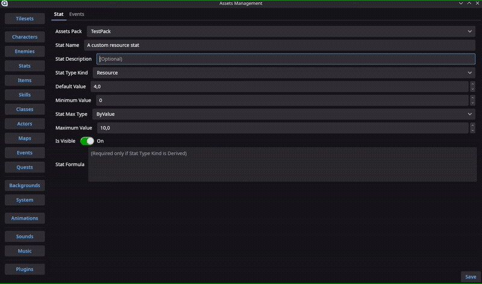
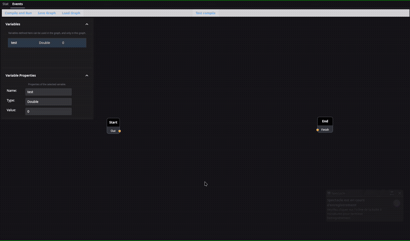
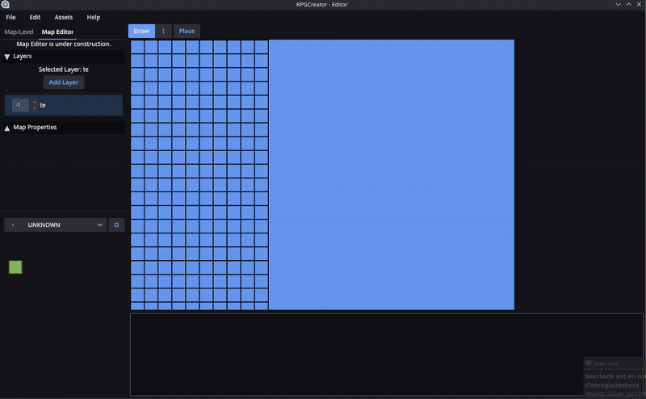

# RPGCreator

A free, open-source, fully editable RPG engine built with MonoGame.

This project is actively in development and not production-ready yet.

## Preview

Feature snapshots (format: `dd-mm-yyyy`):

- Character animation (`31-10-2025`)
  
- Skill editor (`09-10-2025`)
  
- Graph feature (`13-09-2025`)
  
- Bulk animation importer (`09-11-2025`)
  
- Auto tiling (`10-08-2025`)
  

## Follow The Project

- Mastodon: https://mastodon.social/@RPGCreator
- Bluesky: https://bsky.app/profile/rpgcreator.bsky.social
- X/Twitter: https://x.com/RPG_Creator_
- Discord: https://discord.gg/4yfq4NNzs4

## Why This Project Exists

RPGCreator started as an alternative to engines that are:

- not open-source,
- not free,
- hard to extend cleanly,
- hard to maintain through plugins.

The goal is to provide a permissive, moddable RPG engine with strong tooling and a transparent codebase.

## Current Direction

Planned and in-progress areas include:

- Database workflow for characters, items, effects, and more
- Extensive plugin support
- Advanced text editor (WYSIWYG-style capabilities)
- Fully editable game UI/HUD/menu system
- 2D first, then 3D support

## Project Status

This repository is under active development. Many systems are still incomplete, in flux, or being refactored.

## FAQ

### Why publish before it is finished?
Because open development fits the project workflow. You can follow progress, discuss ideas, and contribute early.

### Will it stay free and open-source?
Yes. The intention is to keep it fully free and open-source.

### Is there any revenue model planned?
No locked features, no premium tier. If monetization exists later, it would be donation-based.

### Will it support multiple languages?
Yes. Initial focus is English and French, with community translation support later.

### Can I fork it and build my own version?
Yes, subject to the repository license.

### If I sell a game made with it, do I owe royalties?
No.

### Which operating systems are supported?
Cross-platform support is a goal. Platform coverage is still evolving during development.

### Will there be plugin and engine documentation?
Yes. Documentation is planned as the core stabilizes.

### 2D only, or 3D too?
2D first. 3D is planned later.

### Which language is planned for plugins?
Lua first, with JavaScript support planned later.

### Will there be starter assets?
Possibly. Contributions are welcome.

### Will there be an asset marketplace?
Maybe later, after the engine itself is stable.

## Contributing

Contributions, feedback, and ideas are welcome.

- Join Discord for discussion and updates: https://discord.gg/4yfq4NNzs4
- Open issues for bugs and feature requests

## Third-Party Licenses

This project uses third-party libraries and packages.

See [NOTICE.md](NOTICE.md) for license attributions.

If your work is used and missing attribution, please open an issue or contact the team on Discord.
